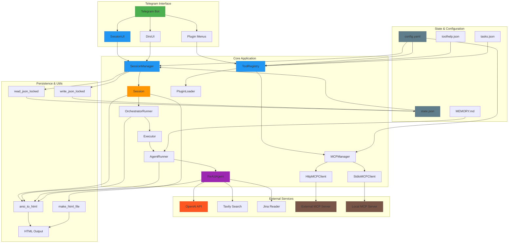

# Архитектура

# Архитектура

Система представляет собой Telegram-бота с поддержкой многопользовательских сессий, CLI-агентов и интеграции с внешними сервисами. Архитектура построена вокруг центрального класса `BotApp`, координирующего взаимодействие между компонентами.

## Основные компоненты

### `SessionManager` и `Session`
`SessionManager` управляет жизненным циклом сессий, обеспечивая создание, активацию, восстановление и сохранение состояния. Каждая сессия (`Session`) изолирована в отдельной рабочей директории и содержит:
- Ссылку на `ToolConfig` (CLI-агент: Codex, Gemini и др.)
- Рабочую директорию (`workdir`)
- Токен возобновления (`resume_token`)
- Очередь команд и состояние занятости

Сессии сохраняются в `state.json` с помощью потокобезопасных операций `read_json_locked`/`write_json_locked`. При старте приложения активные сессии восстанавливаются из файла.

### `SessionUI`
Обеспечивает интерактивное управление сессиями через Telegram. Генерирует меню с помощью `build_sessions_menu()` и обрабатывает действия:
- Выбор/активация сессии
- Переименование (`sess_rename:`)
- Обновление resume-токена (`sess_resume:`)
- Проверка состояния (`sess_state:`)
- Очистка очереди (`sess_clearqueue`)
- Закрытие сессии с вызовом `_on_before_close` и `_on_close`

Ввод данных (имя, токен) обрабатывается в `handle_pending_message()` с поддержкой отмены через "отмена", "-", "Отмена".

### `ToolRegistry` и плагины
Центральный реестр инструментов, управляющий локальными плагинами и удалёнными MCP-инструментами. Ключевые функции:
- Автоматическая загрузка плагинов из директории `plugins/` через `PluginLoader`
- Регистрация инструментов с валидацией по `ToolSpec`
- Фильтрация по `allowed_tools` ("All", "None")
- Выполнение через `execute()` с таймаутом `TOOL_TIMEOUT_MS`
- Поддержка параллельного выполнения (`execute_parallel_or_sequential`)

Плагины реализуют интерфейс `ToolPlugin` и могут включать диалоги через `DialogMixin`.

### `OrchestratorRunner` и `Executor`
Оркестратор (`OrchestratorRunner`) управляет выполнением задач:
1. Планирование через `plan_steps()` с генерацией `PlanStep`
2. Упорядочивание шагов с учётом зависимостей (`_order_steps_safely`)
3. Параллельное выполнение безопасных операций (`_next_batch`)
4. Обработка результатов и обновление памяти (`_apply_step_result`, `_maybe_update_memory`)

`Executor` запускает `AgentRunner`, который инициирует цикл ReAct-агента с вызовом инструментов из `ToolRegistry`.

### `MCPManager`
Управляет подключением к MCP-серверам через два транспорта:
- `stdio`: запуск локального сервера через `StdioMCPClient`
- `http`: подключение к внешнему серверу через `HttpMCPClient`

Инструменты кэшируются в `_shared/mcp_tools_cache.json` для ускорения инициализации. Поддерживает `list_tools()` и `call()` с валидацией аргументов.

## Потоки данных

1. **Пользователь → Бот**: команда `/sessions` → `SessionUI.build_sessions_menu()` → отправка меню
2. **Пользователь → Сессия**: выбор сессии → `SessionManager.set_active()` → обновление `_active` в `state.json`
3. **Агент → Инструмент**: `ReActAgent` вызывает инструмент → `ToolRegistry.execute()` → выполнение плагина
4. **Вывод → Пользователь**: ANSI-вывод → `ansi_to_html()` → `make_html_file()` → отправка HTML-файла

## Безопасность и ограничения

- **Изоляция**: все операции выполняются в пределах `workdir`, проверка через `is_within_root()`
- **Блокировка команд**: `check_command()` с `BLOCKED_PATTERNS_PATH` предотвращает выполнение опасных операций
- **Таймауты**: `TOOL_TIMEOUT_MS` (120 сек), `GREP_TIMEOUT_MS` (30 сек), `WEB_FETCH_TIMEOUT_MS` (90 сек)
- **Ограничение вывода**: `OUTPUT_TRIM_LEN` (3000 символов), `OUTPUT_HEAD_LEN` (1500), `OUTPUT_TAIL_LEN` (1000)
- **Память**: `MEMORY.md` сжимается по приоритету тегов (`PREF > DECISION > CONFIG > AGREEMENT`)

## Конфигурация и состояние

- `config.yaml`: глобальные настройки (`telegram.token`, `defaults.workdir`, `tools.*`, `mcp.*`)
- `state.json`: состояние сессий и активной сессии
- `toolhelp.json`: справка по CLI-инструментам
- `tasks.json`: задачи пользователя
- `MEMORY.md`: долговременная память агента

Переменные окружения имеют приоритет над `config.yaml` (например, `TAVILY_API_KEY`, `JINA_API_KEY`, `GITHUB_TOKEN`).
