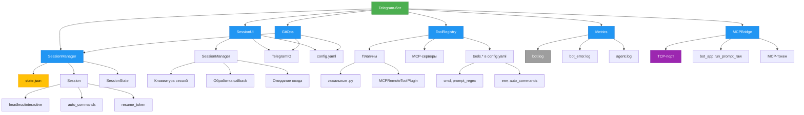

# Архитектура



## Архитектура

Система построена вокруг Telegram-бота, управляющего CLI-агентами через сессии. Архитектура обеспечивает изоляцию, отказоустойчивость и масштабируемость.

### Основные компоненты

**Telegram-бот** — центральный узел, принимающий команды и вложения. Работает в режиме polling, использует `python-telegram-bot` для асинхронной обработки. Ограничивает доступ по `whitelist_chat_ids`.

**SessionManager** — управляет жизненным циклом сессий. Создаёт, активирует, сохраняет и восстанавливает сессии. Хранит состояние в `state.json` с поддержкой миграции с устаревшего формата. Обеспечивает уникальность `session_id` и отслеживает активную сессию.

**Session** — представляет одну сессию CLI-инструмента (Codex, Claude и др.). Поддерживает два режима:
- `headless` — запуск через `asyncio.subprocess`.
- `interactive` — управление через `pexpect` с ожиданием приглашения (`prompt_regex`) и возобновлением по `resume_token`.

**SessionUI** — интерфейс управления сессиями через inline-кнопки. Формирует меню сессий, обрабатывает `callback`-действия (`sess_pick`, `sess_use`, `sess_rename` и др.) и режим ожидания ввода (переименование, установка токена). Использует `pending_session_rename` и `pending_session_resume` для отслеживания контекста.

**GitOps** — выполняет Git-операции (commit, pull, merge, rebase) через inline-меню. Использует `GIT_ASKPASS` для безопасной передачи `github_token`. Поддерживает разрешение конфликтов и вызов агента для правки.

**ToolRegistry** — централизованный реестр инструментов. Загружает локальные плагины из `plugins/` и обнаруживает MCP-серверы. Предоставляет спецификации инструментов в формате OpenAI/Google и управляет их выполнением с таймаутом (`TOOL_TIMEOUT_MS`).

**MCPBridge** — TCP-сервер, принимающий JSON-запросы на выполнение команд. Проверяет токен (`config.mcp.token`) и делегирует обработку `bot_app.run_prompt_raw`. Формат запроса: `{"token", "prompt", "session_id"}`.

**Metrics** — собирает метрики в реальном времени: `messages`, `commands`, `errors`, `queued`. Метод `snapshot` возвращает текстовый отчёт с временем работы и размером последнего вывода.

### Хранение и конфигурация

**state.json** — хранит сессии в формате:
```json
{
  "_sessions": { "session_id": { "tool", "workdir", "resume_token", "name", "updated_at" } },
  "_active": { "session_id", "tool", "workdir", "updated_at" }
}
```
Поддерживает миграцию с устаревшего формата `{tool}::{workdir}`.

**config.yaml** — основной конфигурационный файл. Загружается с подстановкой переменных окружения (`${VAR}`). Ключевые секции:
- `telegram` — токен и `whitelist_chat_ids`.
- `tools` — настройки CLI-инструментов: `cmd`, `prompt_regex`, `env`.
- `defaults` — пути, таймауты, API-ключи.
- `mcp` — параметры встроенного MCP-сервера.
- `presets` — шаблоны команд.

### Безопасность и отказоустойчивость

- **Проверка путей** — `is_within_root` предотвращает выход за пределы `AGENT_SANDBOX_ROOT`.
- **Фильтрация команд** — `BLOCKED_PATTERNS_PATH` блокирует опасные команды (rm -rf, sudo, exfiltration).
- **Повторные попытки** — `TelegramIO` отправляет сообщения до 5 раз при `NetworkError`.
- **Сериализованный доступ** — `read_json_locked` и `write_json_locked` используют системные блокировки для целостности `state.json`.

### Восстановление и интеграции

После перезапуска бот восстанавливает:
- Активные сессии из `state.json`.
- Очередь задач.
- Состояние `toolhelp.json`.

Интеграции:
- **OpenAI** — для суммаризации, генерации коммитов, декомпозиции задач.
- **MCP** — подключение к внешним инструментальным серверам.
- **Git** — inline-операции с поддержкой приватных репозиториев.
- **Плагины** — динамическая загрузка из `plugins/` с поддержкой диалогов через `DialogMixin`.
