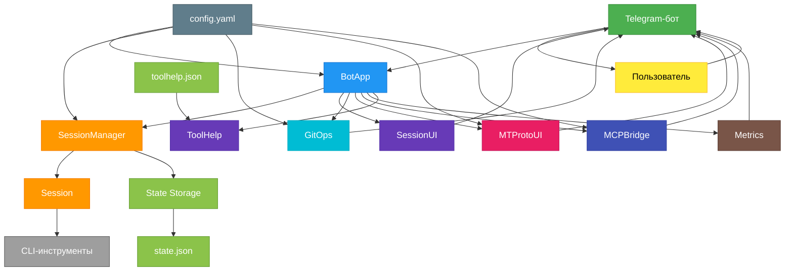

# Архитектура

# Архитектура

Архитектура Telegram-бота построена вокруг центрального класса `BotApp`, управляющего жизненным циклом сессий, обработкой команд и интеграцией с внешними системами. Все компоненты взаимодействуют асинхронно через Telegram API и внутренние состояния.

## Основные компоненты

### `BotApp`
Центральный узел приложения. Инициализирует:
- Обработчики команд (`CommandHandler`, `MessageHandler`, `CallbackQueryHandler`)
- Загрузку конфигурации из `config.yaml`
- Восстановление сессий через `SessionManager`
- Запуск `MCPBridge` при включённой опции
- Установку команд в Telegram через `set_bot_commands`

### `SessionManager`
Управляет всеми сессиями:
- Создание, активация, переключение
- Восстановление из `state.json` при старте
- Потокобезопасный доступ через `run_lock`
- Контроль активной сессии

### `Session`
Инкапсулирует одну сессию CLI-инструмента:
- Запуск процесса через `pexpect.spawn`
- Обработка вывода: ANSI → HTML, Mermaid → SVG
- Поддержка режимов: `headless`, `interactive`, `resume`
- Обнаружение приглашений (`prompt_regex`) и токенов активности
- Очередь команд и автоматические команды при старте

### `SessionUI`
Предоставляет интерфейс управления сессиями:
- Построение меню сессий через `build_sessions_menu`
- Обработка колбэков: выбор, переименование, изменение токена
- Обработка текстовых сообщений при ожидании ввода
- Отображение статуса: занятость, git-состояние, время работы

### `GitOps`
Интеграция с Git:
- Асинхронное выполнение команд через `asyncio.create_subprocess_exec`
- Интерактивное разрешение конфликтов (merge/rebase)
- Безопасная аутентификация через `GIT_ASKPASS` с `github_token`
- Автоматическое `git add -A` и генерация сообщений коммита (с OpenAI)

### `MTProtoUI`
Отправка результатов в Telegram-чаты:
- Использует `Telethon` с `api_id`, `api_hash`, `session_string`
- Выбор цели из `mtproto.targets`
- Отправка текста и файлов через `send_text`, `send_file`
- Поддержка отмены операций

### `MCPBridge`
TCP-сервер для внешних клиентов:
- Слушает на `mcp.host:port`
- Принимает JSON-запросы с `token`, `prompt`, `session_id`
- Возвращает JSON-ответ с результатом
- Проверяет токен, если задан

### `State Storage`
Файловое хранилище состояния:
- `state.json` — сохранение сессий, активной сессии, метаданных
- Ключи: `{tool}::{workdir}`, `_active`, `_sessions`
- Функции: `load_state`, `save_state`, `update_state`, `get_state`

### `ToolHelp`
Кэширование справки по инструментам:
- Хранение в `toolhelp.json`
- `load_toolhelp`, `save_toolhelp`, `update_toolhelp`
- Используется для команд `/toolhelp`, `/tools`

### `Metrics`
Сбор статистики:
- Счётчики: команды, сообщения, ошибки
- `observe_output` — объём и время вывода
- `snapshot()` — текстовый отчёт для `/metrics`

## Потоки данных

1. **Пользователь → Бот**: команда `/new`, `/use`, `/send`, колбэк из меню
2. **Бот → SessionManager**: создание/активация сессии
3. **Session → CLI-инструмент**: запуск команды через `pexpect`
4. **CLI → Session**: вывод (ANSI, Markdown, Mermaid)
5. **Session → BotApp**: обработка вывода (HTML, SVG)
6. **BotApp → Пользователь**: отправка результата (текст, файл)
7. **GitOps → Git**: выполнение команд с подтверждением
8. **MTProtoUI → Telegram API**: отправка в указанные чаты
9. **MCPBridge ← Внешний клиент**: приём JSON-запроса
10. **MCPBridge → BotApp**: выполнение промпта
11. **BotApp → MCPBridge → Клиент**: возврат результата

## Хранение и конфигурация

- **`config.yaml`**: основная конфигурация, приоритет ниже переменных окружения
- **`state.json`**: состояние сессий, сохраняется при `/close`, `/rename`, `/state`
- **`toolhelp.json`**: кэш справки, обновляется при `/toolhelp update`
- **Временные файлы**: HTML-логи, изображения — автоматическая очистка по таймауту

## Безопасность

- Проверка `chat_id` по `whitelist_chat_ids`
- Защита от выхода за пределы `workdir` через `is_within_root`
- Ограничение размера вложений (до 45 МБ)
- Безопасная передача `github_token` через `GIT_ASKPASS`
- Опциональная авторизация для MCP и MTProto

Архитектура обеспечивает автономность, отказоустойчивость и глубокую интеграцию с локальной средой, позволяя управлять CLI-инструментами, Git и файлами через Telegram.
